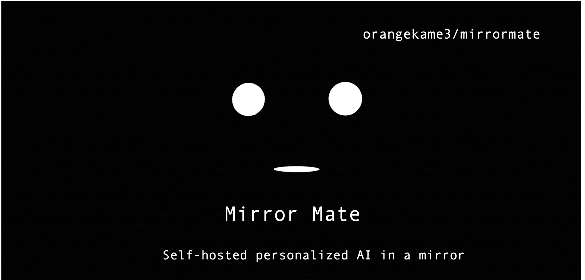

<p align="center">
  
</p>

<h1 align="center">Mirror Mate</h1>

<p align="center">
  <strong>Self-hosted personalized AI in a mirror</strong>
</p>

<p align="center">
  <a href="https://www.orangekame3.net/mirrormate/">Documentation</a> •
  <a href="https://www.orangekame3.net/mirrormate/guide/getting-started">Getting Started</a> •
  <a href="https://github.com/orangekame3/mirrormate/releases">Releases</a>
</p>

<p align="center">
  <a href="https://github.com/orangekame3/mirrormate/blob/main/LICENSE"></a>
  <a href="https://github.com/orangekame3/mirrormate/releases"></a>
  <a href="https://github.com/orangekame3/mirrormate/actions"></a>
</p>

---

https://github.com/user-attachments/assets/c9005df4-9bdb-4190-861e-c8f5f9290468

## Features

- Voice interaction with wake word activation
- Personalized memory (RAG-based context)
- Expressive avatar with lip-sync animation
- Multiple LLM/TTS providers (OpenAI, Ollama, VOICEVOX)
- Built-in weather, calendar, reminders, web search
- Plugin system for custom widgets

## Quick Start

**OpenAI (English):**

```bash
docker run -p 3000:3000 \
  -e OPENAI_API_KEY=sk-xxx \
  -e LLM_PROVIDER=openai \
  -e TTS_PROVIDER=openai \
  -e LOCALE=en \
  ghcr.io/orangekame3/mirrormate:latest
```

**Ollama + VOICEVOX (Japanese, local):**

```bash
ollama pull qwen2.5:14b
git clone https://github.com/orangekame3/mirrormate.git
cd mirrormate && docker compose up -d
```

Open http://localhost:3000 in **Chrome**.

> Set `LOCALE=en` for English or `LOCALE=ja` for Japanese (default).

**Say the wake word to start:**
- English: *"OK Mira"*
- Japanese: *"OK ミラ"*

## Development

```bash
bun install && bun run dev
```

## License

[MIT](LICENSE)
