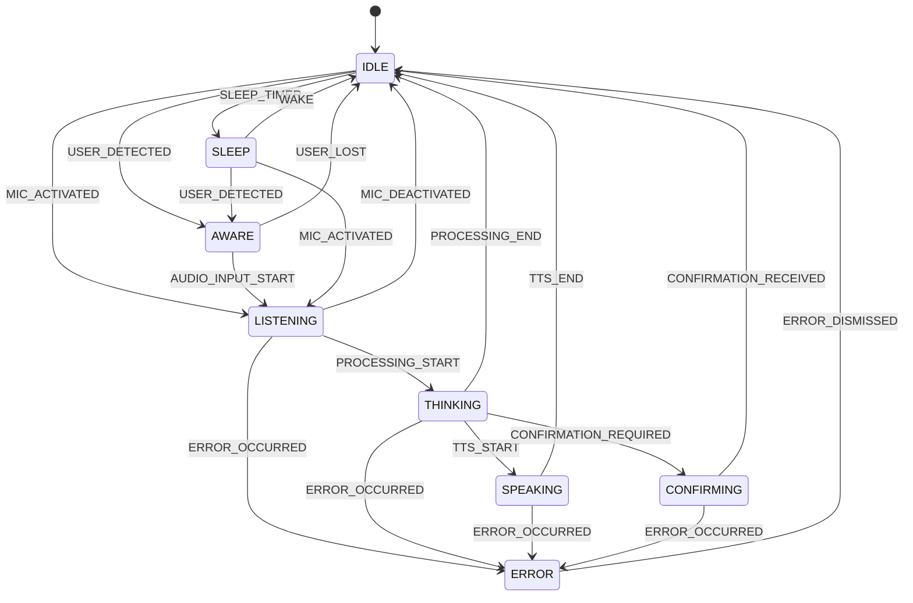
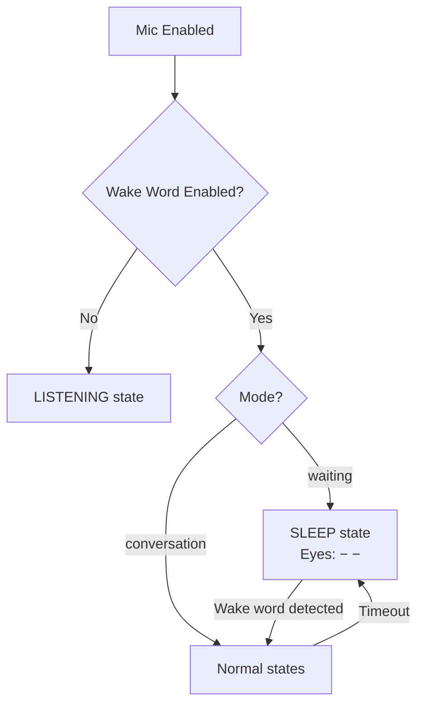
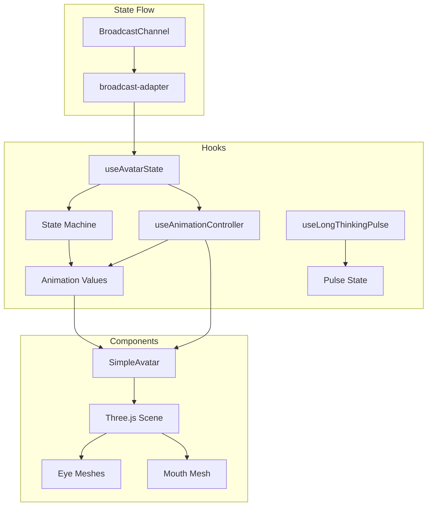

# Animation State Machine

This document describes the avatar animation system, including the state machine, transitions, and visual expressions.

## Overview

The avatar uses a finite state machine to manage animations and visual feedback. Each state has distinct visual characteristics expressed through eye shapes, mouth curves, and animation parameters.

## State Diagram



## States

| State | Description | Eye Shape | Mouth |
|-------|-------------|-----------|-------|
| IDLE | Default resting state | ○ ○ (circle) | Neutral |
| AWARE | User detected, attentive | ○ ○ (circle) | Neutral |
| LISTENING | Voice input active | ◎ ◎ (large) | Neutral |
| THINKING | Processing/reasoning | − − (closed) | Neutral |
| SPEAKING | TTS playback with lip-sync | ○ ○ (circle) | Animated |
| CONFIRMING | Awaiting user confirmation | ○ ◯ (one tilted) | Slight smile |
| ERROR | Error state (non-aggressive) | × × (X marks) | Troubled |
| SLEEP | Low-power/waiting mode | − − (closed) | Neutral |

## Visual Expression System

### Eye Shapes

```
Circle (default):    ○ ○     - IDLE, AWARE, SPEAKING
Large circle:        ◎ ◎     - LISTENING (more attentive)
Closed (line):       − −     - SLEEP, THINKING
X marks:             × ×     - ERROR
Tilted:              ○ ◯     - CONFIRMING (one eye tilted)
```

### Mouth Curves

| State | Curve Value | Visual |
|-------|-------------|--------|
| ERROR | -0.5 | Slightly downturned (troubled) |
| CONFIRMING | 0.2 | Slight upturn (friendly) |
| Others | 0 | Neutral |

## Wake Word Integration

When wake word mode is enabled, the avatar displays SLEEP state while waiting for the wake word phrase.



### Effective State Override

```typescript
const effectiveAvatarState = useMemo(() => {
  if (isWakeWordEnabled && wakeWordMode === "waiting" && !isSpeaking && !isThinking) {
    return "SLEEP";
  }
  return avatarState;
}, [isWakeWordEnabled, wakeWordMode, isSpeaking, isThinking, avatarState]);
```

## Animation Parameters

### Per-State Configuration

| State | Blink Interval | Breathing Cycle | Gaze Tracking |
|-------|----------------|-----------------|---------------|
| IDLE | 8-14s | 5.5-6.5s | No |
| AWARE | 6-10s | 4.5-5.5s | Yes (250ms delay) |
| LISTENING | 4-8s | 4-5s | Yes (200ms delay) |
| THINKING | 3-6s | 3.5-4.5s | No (internal focus) |
| SPEAKING | 4-8s | 4-5s | Yes (300ms delay) |
| CONFIRMING | 5-9s | 4.5-5.5s | Yes (200ms delay) |
| ERROR | 6-10s | 5-6s | No |
| SLEEP | 15-25s | 7-9s | No |

### Timing Configuration

```typescript
const TIMING_CONFIG = {
  maxResponseDelay: 150,      // Max acceptable response delay (ms)
  lingeringDuration: 2000,    // Fade effect after speaking ends
  longThinkingThreshold: 5000, // Show pulse after 5s in THINKING
  errorAutoDismiss: 3000,     // Auto-dismiss error state
  sleepShiftInterval: 90000,  // Burn-in prevention (90s)
};
```

## Architecture



## File Structure

```
src/
├── lib/animation/
│   ├── types.ts          # Type definitions
│   ├── config.ts         # Animation parameters
│   ├── state-machine.ts  # State machine implementation
│   ├── transitions.ts    # Transition definitions
│   ├── broadcast-adapter.ts  # BroadcastChannel integration
│   └── index.ts          # Public exports
├── hooks/
│   ├── useAvatarState.ts        # State machine hook
│   ├── useAnimationController.ts # Animation values hook
│   └── useLongThinkingPulse.ts  # Long thinking indicator
└── components/
    └── SimpleAvatar.tsx   # Three.js avatar component
```

## Events

| Event | Description | Typical Transition |
|-------|-------------|-------------------|
| USER_DETECTED | User presence detected | IDLE → AWARE |
| USER_LOST | User no longer detected | AWARE → IDLE |
| MIC_ACTIVATED | Microphone enabled | → LISTENING |
| MIC_DEACTIVATED | Microphone disabled | → IDLE |
| PROCESSING_START | LLM processing begins | LISTENING → THINKING |
| PROCESSING_END | LLM processing ends | THINKING → IDLE |
| TTS_START | Text-to-speech starts | THINKING → SPEAKING |
| TTS_END | Text-to-speech ends | SPEAKING → IDLE |
| ERROR_OCCURRED | Error detected | → ERROR |
| ERROR_DISMISSED | Error acknowledged | ERROR → IDLE |
| SLEEP_TIMER | Idle timeout | IDLE → SLEEP |
| WAKE | Wake event | SLEEP → IDLE |

## Demo Page

A demo page is available at `/demo` for testing state transitions:

- **Keyboard Controls**: Press 1-8 to force states
- **Space Bar**: Test mouth animation
- **Mouse Movement**: Test gaze tracking

```
[1] IDLE
[2] AWARE
[3] LISTENING
[4] THINKING
[5] SPEAKING
[6] CONFIRMING
[7] ERROR
[8] SLEEP
```
