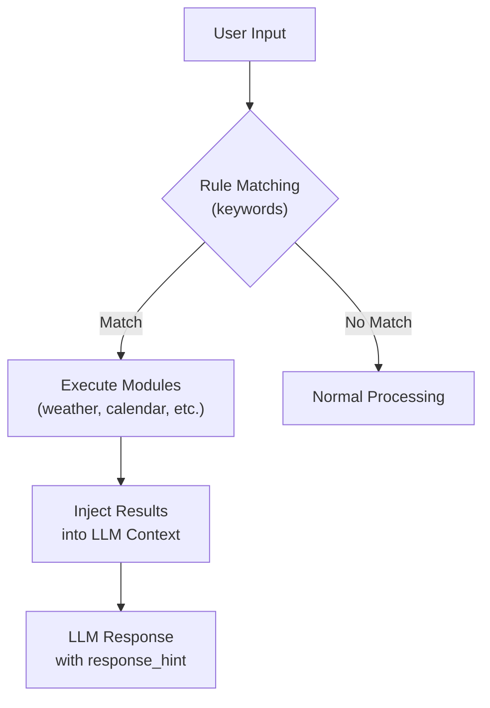

# Rules & Modules

The rule system allows you to define automated workflows that trigger based on user input patterns.

## Overview



## Configuration Files

Rules and modules are locale-specific. Edit the files for your language:

- **Japanese**: `config/locales/ja/rules.yaml`, `config/locales/ja/modules.yaml`
- **English**: `config/locales/en/rules.yaml`, `config/locales/en/modules.yaml`

Set the locale in `config/app.yaml`:

```yaml
app:
  locale: "en"  # or "ja"
```

## Rules Configuration

### Basic Structure

```yaml
rules:
  rule_name:
    description: What this rule does
    triggers:
      keywords:
        - keyword1
        - keyword2
    actions:
      - module: module_name
      - module: another_module
        params:
          key: value
    response_hint: |
      Instructions for how to respond
    effect: confetti  # Optional: trigger visual effect
```

### Example: Morning Greeting

::: code-group

```yaml [English]
rules:
  morning_greeting:
    description: Share daily information with a morning greeting
    triggers:
      keywords:
        - good morning
        - morning
    actions:
      - module: time
      - module: weather
      - module: calendar
      - module: web_search
        params:
          query: "today's news headlines"
    response_hint: |
      As a morning greeting, summarize these in a friendly way:
      - Today's date and day of the week
      - Today's weather
      - Today's schedule
      - Today's major news (just 1-2 items briefly)
    effect: confetti
```

```yaml [Japanese]
rules:
  morning_greeting:
    description: 朝の挨拶で一日の情報をまとめて伝える
    triggers:
      keywords:
        - おはよう
        - おはようございます
    actions:
      - module: time
      - module: weather
      - module: calendar
      - module: web_search
        params:
          query: "今日のニュース 主要"
    response_hint: |
      朝の挨拶として、以下の情報をフレンドリーにまとめて伝えてね:
      - 今日の日付と曜日
      - 今日の天気
      - 今日の予定
      - 今日の主要ニュース（1-2個だけ簡潔に）
    effect: confetti
```

:::

### Triggers

Currently supported trigger types:

| Type | Description |
|------|-------------|
| `keywords` | List of keywords to match (case-insensitive, partial match) |

### Actions

Actions execute modules in order and collect their results.

```yaml
actions:
  - module: weather           # Simple module call
  - module: web_search        # Module with parameters
    params:
      query: "search query"
```

### Response Hint

The `response_hint` is appended to the context to guide how the LLM should respond:

```yaml
response_hint: |
  Based on the information above:
  - Summarize the weather briefly
  - Mention any important events
  - Keep the response under 3 sentences
```

### Visual Effects

Optionally trigger a visual effect when the rule matches:

```yaml
effect: confetti  # Options: confetti, hearts, sparkles
```

## Modules Configuration

Modules are reusable data sources that can be called by rules.

### Module Types

| Type | Description |
|------|-------------|
| `feature` | Use an existing feature (weather, calendar, time) |
| `tool` | Use an existing tool (web_search) |
| `api` | Call an external API |
| `static` | Return a static message |

### Feature Module

Use an existing feature:

::: code-group

```yaml [English]
modules:
  weather:
    type: feature
    description: Get current weather and temperature
    config:
      feature: weather
```

```yaml [Japanese]
modules:
  weather:
    type: feature
    description: 現在の天気と気温を取得
    config:
      feature: weather
```

:::

### Tool Module

Use an existing tool:

::: code-group

```yaml [English]
modules:
  web_search:
    type: tool
    description: Search for information on the internet
    config:
      tool: web_search
```

```yaml [Japanese]
modules:
  web_search:
    type: tool
    description: インターネットで情報を検索
    config:
      tool: web_search
```

:::

### API Module

Call an external API. The Wikipedia API automatically uses the appropriate language based on locale:

::: code-group

```yaml [English]
modules:
  today_info:
    type: api
    description: Look up what day it is (anniversaries, events)
    config:
      source: wikipedia_api  # Uses en.wikipedia.org
```

```yaml [Japanese]
modules:
  today_info:
    type: api
    description: 今日がなんの日か調べる
    config:
      source: wikipedia_api  # Uses ja.wikipedia.org
```

:::

### Static Module

Return a static message:

```yaml
modules:
  custom_message:
    type: static
    description: Return a fixed message
    config:
      message: "This is a static message"
```

## Built-in Modules

| Module | Type | Description |
|--------|------|-------------|
| `time` | feature | Current date and time |
| `weather` | feature | Current weather |
| `calendar` | feature | Today's events |
| `web_search` | tool | Web search via Tavily |
| `today_info` | api | "What day is today" info (locale-aware) |

## How Rules Override Normal Behavior

When a rule matches:

1. **Tools are disabled**: The LLM won't make additional tool calls (data is already gathered by modules)
2. **Context is injected**: Module results are added to the system prompt
3. **Response hint guides output**: The hint tells the LLM how to format the response
4. **Effect is triggered**: If specified, the visual effect plays

When no rule matches:

1. Normal feature context is used (weather, calendar, time)
2. Tools (web search, effects) are available for the LLM to call
3. No response hint is applied
