# Discord Integration

MirrorMate can share information to Discord, allowing you to access search results, weather info, and other data on your phone.

## Overview

```mermaid
flowchart LR
    A[Smart Mirror] -->|Webhook POST| B[Discord Server]
    B --> C[📱 Phone Notification]
    B --> D[💻 Desktop]
    B --> E[🖥️ Web Browser]
```



## Setup

### 1. Create a Discord Webhook

1. Open Discord and go to your server
2. Right-click on the channel where you want to receive messages
3. Select **Edit Channel** → **Integrations** → **Webhooks**
4. Click **New Webhook**
5. Name it "MirrorMate" (optional)
6. Copy the **Webhook URL**

### 2. Configure in features.yaml (Recommended)

Edit `config/features.yaml`:

```yaml
features:
  discord:
    enabled: true
    webhookUrl: "https://discord.com/api/webhooks/123456789/abcdefg..."
    autoShare:
      searchResults: true  # Auto-share web search results
      weather: false       # Auto-share weather updates
      calendar: false      # Auto-share calendar events
```

### Alternative: Environment Variable

You can also use an environment variable (takes precedence over config file):

```bash
DISCORD_WEBHOOK_URL=https://discord.com/api/webhooks/123456789/abcdefg...
```

Or in Docker Compose:

```yaml
services:
  mirrormate:
    environment:
      - DISCORD_WEBHOOK_URL=https://discord.com/api/webhooks/...
```

## Features

### Automatic Sharing

When Discord is configured, the following information is automatically shared:

| Feature | Trigger | What's Shared |
|---------|---------|---------------|
| Web Search | Any search query | Search results with links |

### Manual Sharing via LLM

The AI can share information on request using the `share_to_discord` tool:

**Example prompts:**
- "Share this to Discord"
- "Send the search results to my phone"
- "Save this information for later"

## Message Format

Messages are sent as rich embeds with the following structure:

```
┌─────────────────────────────────────┐
│ 🔍 Search: Next.js 15 features      │
├─────────────────────────────────────┤
│ Server Actions improvements         │
│ Enhanced performance with...        │
│ 🔗 Link                             │
├─────────────────────────────────────┤
│ Partial Prerendering                │
│ New rendering strategy that...      │
│ 🔗 Link                             │
├─────────────────────────────────────┤
│ MirrorMate Search Results           │
│ Today at 14:32                      │
└─────────────────────────────────────┘
```

## Available Functions

### sendSearchResults

Sends web search results to Discord.

```typescript
await sendSearchResults("query", [
  { title: "Result 1", url: "https://...", content: "..." },
  { title: "Result 2", url: "https://...", content: "..." },
]);
```

### sendWeatherInfo

Sends weather information to Discord.

```typescript
await sendWeatherInfo("Tokyo", "Sunny", 25, "Clear skies expected");
```

### sendCalendarEvents

Sends upcoming calendar events to Discord.

```typescript
await sendCalendarEvents([
  { title: "Meeting", time: "14:00", description: "Team sync" },
]);
```

### sendTextMessage

Sends a simple text message to Discord.

```typescript
await sendTextMessage("Title", "Content", "https://optional-url.com");
```

### sendConversationSummary

Sends a conversation exchange to Discord.

```typescript
await sendConversationSummary("User message", "Assistant response");
```

## Embed Colors

| Type | Color | Hex |
|------|-------|-----|
| Info | Blurple | `#5865F2` |
| Success | Green | `#57F287` |
| Warning | Yellow | `#FEE75C` |
| Error | Red | `#ED4245` |
| Search | Blue | `#3498DB` |
| Weather | Orange | `#F39C12` |
| Calendar | Purple | `#9B59B6` |

## Architecture

```
src/lib/
├── discord/
│   └── index.ts          # Discord webhook service
└── tools/
    └── discord-share.ts  # LLM tool for manual sharing
```

## Troubleshooting

### Messages not appearing

1. Verify the webhook URL is correct
2. Check the channel permissions
3. Ensure the webhook hasn't been deleted

### Rate limiting

Discord webhooks have rate limits. If you're sending too many messages, you may see failures. The service handles errors gracefully and logs them.

### Webhook URL security

Keep your webhook URL private. Anyone with the URL can post messages to your channel. If compromised:

1. Delete the webhook in Discord
2. Create a new webhook
3. Update your environment variable
