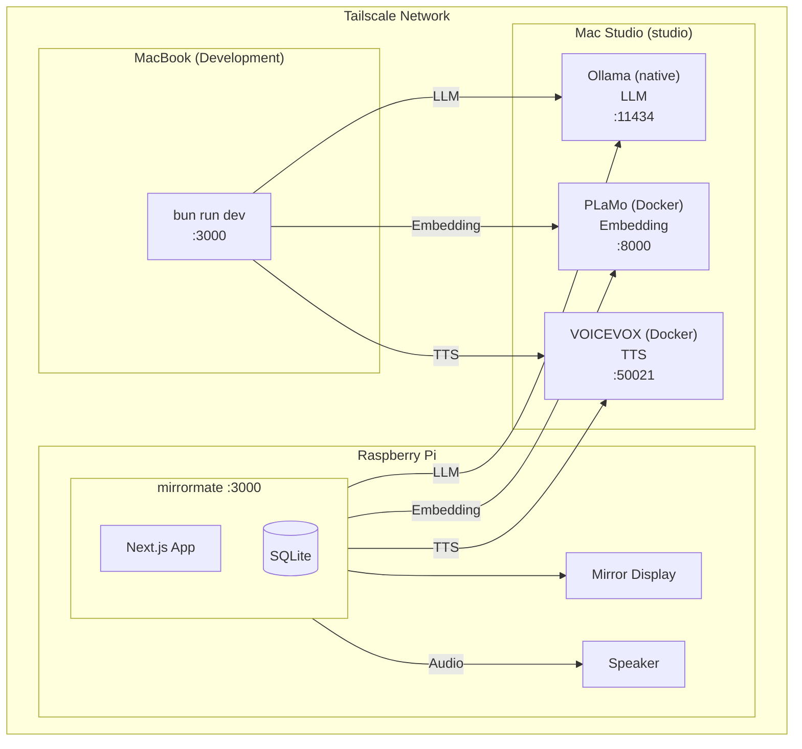
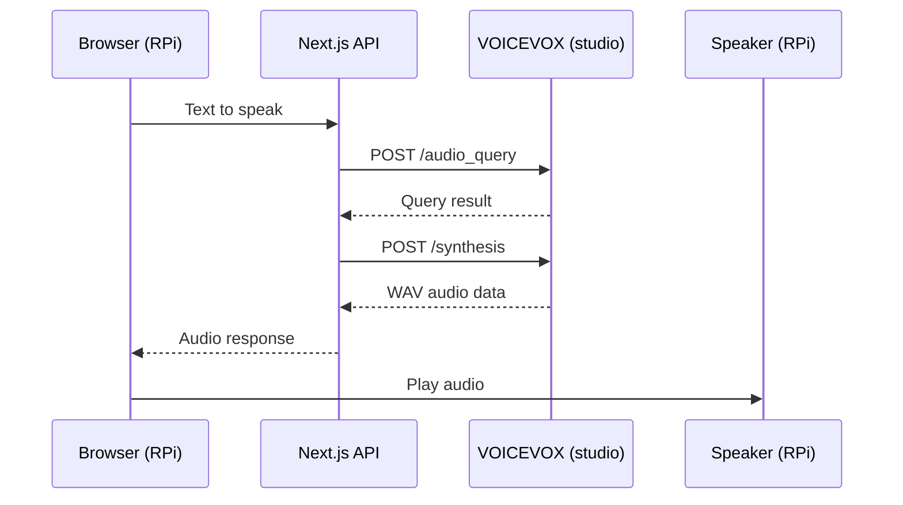
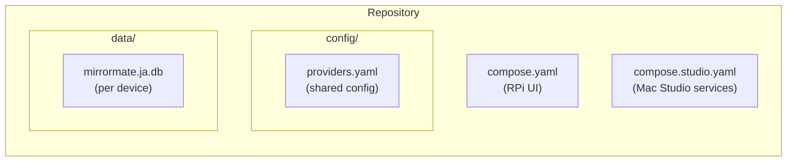

# Recommended Setup

This guide describes the recommended production setup for Mirror Mate using Tailscale to connect a Raspberry Pi display with a Mac Studio backend.

## Architecture Overview



## Why This Setup?

| Component | Location | Reason |
|-----------|----------|--------|
| **Ollama** | Mac Studio (native) | Metal GPU acceleration for fast LLM inference |
| **PLaMo-Embedding-1B** | Mac Studio (Docker) | Japanese-optimized embedding, top JMTEB scores |
| **VOICEVOX** | Mac Studio (Docker) | CPU-intensive, containerized for easy management |
| **UI** | Raspberry Pi | Low power, silent, dedicated display |
| **Development** | MacBook | Same config as production, no local services needed |

## Prerequisites

- Mac Studio (Apple Silicon recommended)
- Raspberry Pi 4/5 with display
- MacBook for development
- [Tailscale](https://tailscale.com/) account (free tier is sufficient)

## Step 1: Tailscale Setup

Install Tailscale on all devices:

### Mac Studio / MacBook

```bash
brew install tailscale
```

Open Tailscale from Applications and sign in.

### Raspberry Pi

```bash
curl -fsSL https://tailscale.com/install.sh | sh
sudo tailscale up
```

### Verify Connection

After all devices are connected, verify they can reach each other:

```bash
# From MacBook or RPi
ping studio    # Mac Studio's Tailscale hostname
```

You can find/set hostnames in the [Tailscale admin console](https://login.tailscale.com/admin/machines).

## Step 2: Mac Studio Setup

### Install Ollama (Native)

```bash
# Install
brew install ollama

# Start as service
brew services start ollama

# Pull LLM model
ollama pull gpt-oss:20b
```

### Start Docker Services (VOICEVOX + PLaMo)

First, install Docker via [OrbStack](https://orbstack.dev/) (recommended for Apple Silicon):

```bash
brew install orbstack
open -a OrbStack
```

Then start services:

```bash
cd /path/to/mirrormate
docker compose -f compose.studio.yaml up -d
```

This starts:
- **VOICEVOX** (:50021) - Text-to-speech
- **PLaMo-Embedding-1B** (:8000) - Japanese-optimized text embedding

### Verify Services

```bash
# Ollama (LLM)
curl http://localhost:11434/api/tags

# VOICEVOX (TTS)
curl http://localhost:50021/speakers | head

# PLaMo (Embedding)
curl http://localhost:8000/health
```

## Step 3: Configuration

Create or edit `config/providers.yaml`:

```yaml
providers:
  llm:
    enabled: true
    provider: ollama
    ollama:
      model: gpt-oss:20b
      baseUrl: "http://studio:11434"  # Tailscale hostname
      maxTokens: 300
      temperature: 0.7

  tts:
    enabled: true
    provider: voicevox
    voicevox:
      speaker: 2
      baseUrl: "http://studio:50021"  # Tailscale hostname

  embedding:
    enabled: true
    provider: ollama  # PLaMo server provides Ollama-compatible API
    ollama:
      model: plamo-embedding-1b
      baseUrl: "http://studio:8000"  # PLaMo embedding server

  memory:
    enabled: true
    rag:
      topK: 8
      threshold: 0.3
    extraction:
      autoExtract: true
      minConfidence: 0.5
```

## Step 4: Web Search Setup (Optional)

To enable web search functionality:

1. Get an API key from [Ollama](https://ollama.com/settings/keys)
2. Add to `.env` on the Raspberry Pi:

```bash
OLLAMA_API_KEY=your-ollama-api-key-here
```

## Step 5: Raspberry Pi Setup

### Clone Repository

```bash
git clone https://github.com/orangekame3/mirrormate.git
cd mirrormate
```

### Create Environment File

```bash
cp .env.example .env
# Edit .env with your API keys (optional services)
```

### Start Application

```bash
docker compose up -d
```

### Auto-start on Boot (Optional)

```bash
# Add to /etc/rc.local or create systemd service
cd /home/pi/mirrormate && docker compose up -d
```

### Access

Open http://localhost:3000 on the RPi's browser, or http://rpi:3000 from another device.

## Step 6: Development (MacBook)

With this setup, development requires no local services:

```bash
cd mirrormate
bun install
bun run dev
```

The app connects to Mac Studio for all heavy processing via Tailscale.

## Audio Flow



The audio plays from the device running the browser (RPi), not from Mac Studio.

Ensure your RPi has speakers connected and audio output configured:

```bash
# Test audio on RPi
aplay /usr/share/sounds/alsa/Front_Center.wav
```

## File Structure



## Commands Reference

### Mac Studio

```bash
# Start services (VOICEVOX + PLaMo)
docker compose -f compose.studio.yaml up -d

# Stop services
docker compose -f compose.studio.yaml down

# View logs
docker compose -f compose.studio.yaml logs -f

# View PLaMo logs
docker compose -f compose.studio.yaml logs -f plamo-embedding

# Rebuild PLaMo after updates
docker compose -f compose.studio.yaml build plamo-embedding

# Restart Ollama
brew services restart ollama
```

### Raspberry Pi

```bash
# Start UI
docker compose up -d

# Stop UI
docker compose down

# View logs
docker compose logs -f

# Rebuild after updates
git pull
docker compose build --no-cache
docker compose up -d
```

### Development (MacBook)

```bash
# Start dev server
bun run dev

# Build
bun run build

# Test
bun run test
```

## Troubleshooting

### Cannot connect to studio

**Error**: Connection refused to `studio:11434`

**Solution**:
1. Verify Tailscale is running: `tailscale status`
2. Check hostname: `ping studio`
3. Ensure Ollama is running: `brew services list | grep ollama`

### VOICEVOX timeout

**Error**: TTS request timeout

**Solution**:
1. Check container: `docker compose -f compose.studio.yaml ps`
2. First request is slow (model loading), wait ~30 seconds
3. Check logs: `docker compose -f compose.studio.yaml logs voicevox`

### No audio on RPi

**Solution**:
1. Check audio output: `aplay -l`
2. Set correct output: `raspi-config` → Audio
3. Test: `speaker-test -t wav`

### Memory not shared between devices

This is expected. Each device has its own SQLite database. To copy memories:

```bash
# From MacBook to RPi
scp data/mirrormate.ja.db pi@rpi:~/mirrormate/data/
```

## Next Steps

- [Docker Setup](docker.md) - Detailed Docker configuration
- [Locale Presets](../config/presets.md) - Configure timezone, weather, and STT by locale
- [Providers Configuration](../config/providers.md) - LLM/TTS provider options
- [Memory System](memory.md) - RAG and memory management
